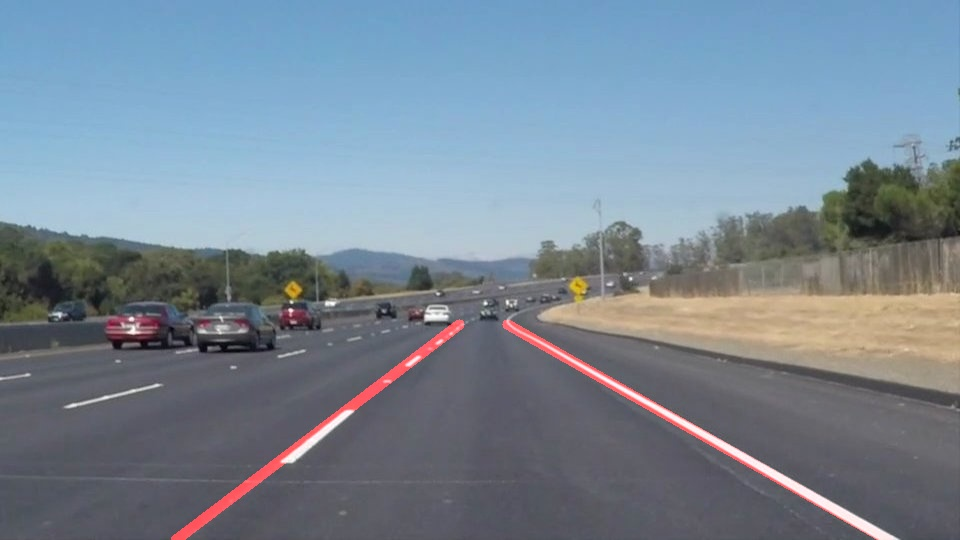

# **Finding Lane Lines on the Road** 

## Writeup Template

### You can use this file as a template for your writeup if you want to submit it as a markdown file. But feel free to use some other method and submit a pdf if you prefer.

---

**Finding Lane Lines on the Road**

The goals / steps of this project are the following:
* Make a pipeline that finds lane lines on the road
* Reflect on your work in a written report

[//]: # (Image References)

[image1]: ./examples/grayscale.jpg "Grayscale"

---

### Reflection

### 1. Describe your pipeline. As part of the description, explain how you modified the draw_lines() function.

My pipeline consisted of 6 steps. 

**Step1**, I converted the images to grayscale;

**Step2**, Apply Gaussian smoothing to soomth getting rid of the noise of image;

**Step3**, Apply the Canny transform for edge detection;

**Step4**, Apply an image mask and only keeps the region of interest;

**Step5**, Run Hough on edge detected image, to detect lines;

**Step6**, Average and extrapolate the line segments I've detected to map out the full extent of the lane lines,and draw lines on origin image.

The following images shows how the pipeline works: 

### 2. Identify potential shortcomings with your current pipeline

One potential shortcoming would be what would happen when under different lighting conditions.

Another shortcoming could be when there are too much lane curvatures my current pipeline performs badly.

### 3. Suggest possible improvements to your pipeline

A possible improvement would be to combine it with different color space channel thresholds.

