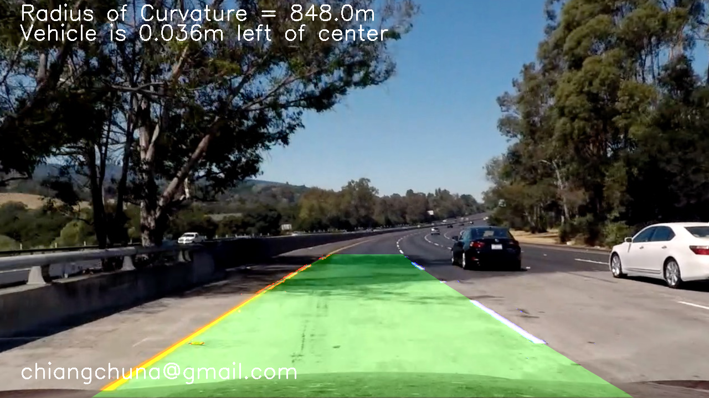

**Advanced Lane Finding Project**

The goals / steps of this project are the following:

* Compute the camera calibration matrix and distortion coefficients given a set of chessboard images.
* Apply a distortion correction to raw images.
* Use color transforms, gradients, etc., to create a thresholded binary image.
* Apply a perspective transform to rectify binary image ("birds-eye view").
* Detect lane pixels and fit to find the lane boundary.
* Determine the curvature of the lane and vehicle position with respect to center.
* Warp the detected lane boundaries back onto the original image.
* Output visual display of the lane boundaries and numerical estimation of lane curvature and vehicle position.

[//]: # (Image References)

[image1]: ./examples/undistort_output.png "Undistorted"
[image2]: ./test_images/test1.jpg "Road Transformed"
[image3]: ./examples/binary_combo_example.jpg "Binary Example"
[image4]: ./examples/warped_straight_lines.jpg "Warp Example"
[image5]: ./examples/color_fit_lines.jpg "Fit Visual"
[image6]: ./examples/example_output.jpg "Output"
[video1]: ./project_video.mp4 "Video"

## [Rubric](https://review.udacity.com/#!/rubrics/571/view) Points

### Here I will consider the rubric points individually and describe how I addressed each point in my implementation.  

---

### Camera Calibration

#### 1. Briefly state how you computed the camera matrix and distortion coefficients. Provide an example of a distortion corrected calibration image.

The code for this step is contained in the first code cell of the IPython notebook located in "./Advanced_Lane_Lines.ipynb" (or in lines `12` through  `34` of the file called `advanced_lane_lines.py`).  

I start by preparing "object points", which will be the (x, y, z) coordinates of the chessboard corners in the world. Here I am assuming the chessboard is fixed on the (x, y) plane at z=0, such that the object points are the same for each calibration image.  Thus, `objp` is just a replicated array of coordinates, and `objpoints` will be appended with a copy of it every time I successfully detect all chessboard corners in a test image.  `imgpoints` will be appended with the (x, y) pixel position of each of the corners in the image plane with each successful chessboard detection.  

####advanced_lane_lines.py(Lines 12 through 34)

	def get_objpoints_imgpoints(images):
	    # prepare object points, like (0,0,0), (1,0,0), (2,0,0) ....,(6,5,0)
	    objp = np.zeros((6*9,3), np.float32)
	    objp[:,:2] = np.mgrid[0:9,0:6].T.reshape(-1,2)
	
	    # Arrays to store object points and image points from all the images.
	    objpoints = [] # 3d points in real world space
	    imgpoints = [] # 2d points in image plane.
	    
	    # Step through the list and search for chessboard corners
	    for fname in images:
	        img = cv2.imread(fname)
	        gray = cv2.cvtColor(img,cv2.COLOR_BGR2GRAY)
	
	        # Find the chessboard corners
	        ret, corners = cv2.findChessboardCorners(gray, (9,6),None)
	
	        # If found, add object points, image points
	        if ret == True:
	            objpoints.append(objp)
	            imgpoints.append(corners)
	    
	    return objpoints, imgpoints

I then used the output `objpoints` and `imgpoints` to compute the camera calibration and distortion coefficients using the `cv2.calibrateCamera()` function.  I applied this distortion correction to the test image using the `cv2.undistort()` function and obtained this result: 
####advanced_lane_lines.py(Lines 37 through 41)

	def cal_undistort(img, objpoints, imgpoints):
	    ret, mtx, dist, rvecs, tvecs = cv2.calibrateCamera(objpoints, imgpoints, img.shape[1::-1], None, None)
	    undist = cv2.undistort(img, mtx, dist, None, mtx)
	    return undist

### Pipeline (single images)

#### 1. Provide an example of a distortion-corrected image.

To demonstrate this step, I will describe how I apply the distortion correction to one of the test images like this one:

#### 2. Describe how (and identify where in your code) you used color transforms, gradients or other methods to create a thresholded binary image.  Provide an example of a binary image result.

I used a combination of color(R channel and S channel) and gradient(sobel x ,sobel y, direction and magnitude) thresholds to generate a binary image (thresholding steps at lines `451` through `580` in `advanced_lane_lines.py`).  Here's an example of my output for this step.  (note: this is not actually from one of the test images)

>As shown in output images above,with combination of color(R channel and S channel) and gradient(sobel x ,sobel y, direction and magnitude) thresholds, lane lines were clearly seperated out from other lines in shadow and strong light conditions.

#### 3. Describe how (and identify where in your code) you performed a perspective transform and provide an example of a transformed image.

The code for my perspective transform includes a function called `warper()`, which appears in lines `45` through `68` in the file `advanced_lane_lines.py` .  The `warper()` function takes as inputs an image (`img`), as well as source (`src`) and destination (`dst`) points.  I chose the hardcode the source and destination points in the following manner:

	src = np.float32(
	    [[(img_size[0] / 2) - 55, img_size[1] / 2 + 100],
	    [((img_size[0] / 6) - 10), img_size[1]],
	    [(img_size[0] * 5 / 6) + 60, img_size[1]],
	    [(img_size[0] / 2 + 55), img_size[1] / 2 + 100]])
	dst = np.float32(
	    [[(img_size[0] / 4), 0],
	    [(img_size[0] / 4), img_size[1]],
	    [(img_size[0] * 3 / 4), img_size[1]],
	    [(img_size[0] * 3 / 4), 0]])

This resulted in the following source and destination points:
	
| Source        | Destination  | 
| ------------- |--------------| 
| 585, 460      | 320, 0       | 
| 203, 720      | 320, 720     |
| 1127, 720     | 960, 720     |
| 695, 460      | 960, 0       |

I verified that my perspective transform was working as expected by drawing the `src` and `dst` points onto a test image and its warped counterpart to verify that the lines appear parallel in the warped image.

#### 4. Describe how (and identify where in your code) you identified lane-line pixels and fit their positions with a polynomial?

Then I did some other stuff and fit my lane lines with a 2nd order polynomial kinda like this:(I did this in lines `72` through `361` in my code in `advanced_lane_lines.py`)

Firstly, determine the x-position of the base of the lane lines by create a histogram with the above warped image. 
Secondly, find pixels belonging to each line through the sliding window method.
Thirdly, fit a polynomial to all the relevant pixels found in sliding windows , and cache the polynomial to skip the sliding window. If lines not detected from prior, search by sliding window.

#### 5. Describe how (and identify where in your code) you calculated the radius of curvature of the lane and the position of the vehicle with respect to center.

I did this in lines `365` through `393` in my code in `advanced_lane_lines.py`

**1).For calculating the radius of curvature of the lane:**
I located the lane line pixels, used their x and y pixel positions to fit a second order polynomial curve:

$f(y) = Ay^2 + By + C$

According to the 

${\LARGE R_{curve} = \frac{[1 + (\frac{dx}{dy})^2]^{3/2}}{|\frac{d^2x}{dy^2}|}}$

In the case of the second order polynomial above, the first and second derivatives are:

${\large f'(y) = \frac{dx}{dy} = 2Ay + B}$

${\large f''(y) = \frac{d^2x}{dy^2} = 2A}$

So, our equation for radius of curvature becomes:

${\LARGE R_{curve} = \frac{(1 + (2Ay + B)^2)^{3/2}}{\left |2A \right |}}$

The ${y}$ values of the image increase from top to bottom, so I measure the radius of curvature closest to the vehicle, by evaluating the formula above at the ${y}$ value corresponding to the bottom of the image.

**2).For the position of the vehicle with respect to center:**
I assume the camera is mounted at the center of the car, such that the lane center is the midpoint at the bottom of the image between the two lines I've detected. The offset of the lane center from the center of the image (converted from pixels to meters) is my distance from the center of the lane.

#### 6. Provide an example image of your result plotted back down onto the road such that the lane area is identified clearly.

I implemented this step in lines `396` through `431` in my code in `advanced_lane_lines.py` in the function `map_lane()`.  Here is an example of my result on a test image:

---

### Pipeline (video)

#### 1. Provide a link to your final video output.  Your pipeline should perform reasonably well on the entire project video (wobbly lines are ok but no catastrophic failures that would cause the car to drive off the road!).

Here's a [link to my video result](./output_videos/test_project_video.mp4)

---

### Discussion

#### 1. Briefly discuss any problems / issues you faced in your implementation of this project.  Where will your pipeline likely fail?  What could you do to make it more robust?

Here I'll talk about the approach I took, what techniques I used, what worked and why, where the pipeline might fail and how I might improve it if I were going to pursue this project further.  

* It is really a challenge to detect lane lines under different lighting conditions. So instead of using HLS space alone, I combined HLS space with RGB space(S channel and R channel) , and it turns out this combination of color thresholds doing a fairly robust job of picking up the lines under very different color and contrast conditions.

* My pipeline may fail when the road condition is not good. I might improve it by improving image quality and enhancing lane line feature information.
