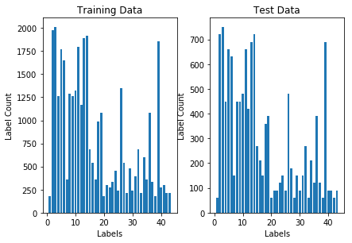
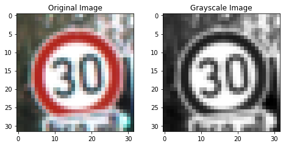
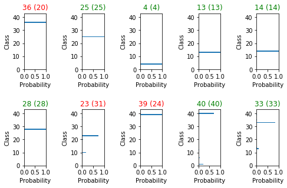

# **Traffic Sign Recognition** 

## Writeup

### You can use this file as a template for your writeup if you want to submit it as a markdown file, but feel free to use some other method and submit a pdf if you prefer.

---

**Build a Traffic Sign Recognition Project**

The goals / steps of this project are the following:
* Load the data set (see below for links to the project data set)
* Explore, summarize and visualize the data set
* Design, train and test a model architecture
* Use the model to make predictions on new images
* Analyze the softmax probabilities of the new images
* Summarize the results with a written report

[//]: # (Image References)

[image1]: ./images/visualization_of_dataset.png "Visualization"
[image2]: ./images/grayscale.png "Grayscaling"
[image3]: ./examples/random_noise.jpg "Random Noise"
[image4]: ./examples/placeholder.png "Traffic Sign 1"
[image5]: ./examples/placeholder.png "Traffic Sign 2"
[image6]: ./examples/placeholder.png "Traffic Sign 3"
[image7]: ./examples/placeholder.png "Traffic Sign 4"
[image8]: ./examples/placeholder.png "Traffic Sign 5"

## Rubric Points
### Here I will consider the [rubric points](https://review.udacity.com/#!/rubrics/481/view) individually and describe how I addressed each point in my implementation.  

---
### Writeup / README

#### 1. Provide a Writeup / README that includes all the rubric points and how you addressed each one. You can submit your writeup as markdown or pdf. You can use this template as a guide for writing the report. The submission includes the project code.

You're reading it! and here is a link to my [project code](https://github.com/udacity/CarND-Traffic-Sign-Classifier-Project/blob/master/Traffic_Sign_Classifier.ipynb)

### Data Set Summary & Exploration

#### 1. Provide a basic summary of the data set. In the code, the analysis should be done using python, numpy and/or pandas methods rather than hardcoding results manually.

I used the pandas library to calculate summary statistics of the traffic
signs data set:

* The size of training set is **`34799`**;
* The size of the validation set is **`4410`**;
* The size of test set is **`12630`**;
* The shape of a traffic sign image is **`(32, 32, 3)`**;
* The number of unique classes/labels in the data set is **`43`**。

#### 2. Include an exploratory visualization of the dataset.

Here is an exploratory visualization of the data set. 

### Design and Test a Model Architecture

#### 1. Describe how you preprocessed the image data. What techniques were chosen and why did you choose these techniques? Consider including images showing the output of each preprocessing technique. Pre-processing refers to techniques such as converting to grayscale, normalization, etc. (OPTIONAL: As described in the "Stand Out Suggestions" part of the rubric, if you generated additional data for training, describe why you decided to generate additional data, how you generated the data, and provide example images of the additional data. Then describe the characteristics of the augmented training set like number of images in the set, number of images for each class, etc.)

As a first step, I decided to convert the images to grayscale because it can keep as much information as possible in the image, but remove these extra channels not needed.Thus it can make computing more efficient.

Here is an example of a traffic sign image before and after grayscaling.

As a last step, I normalized the image data because it makes it much easier for the optimization to proceed numerically, and speed up the convergence of neural network.

#### 2. Describe what your final model architecture looks like including model type, layers, layer sizes, connectivity, etc.) Consider including a diagram and/or table describing the final model.

My final model consisted of the following layers:

| Layer         		|     Description	        					| 
|:---------------------:|:---------------------------------------------:| 
| Input         		| 32x32x1 Grayscale image   					| 
| Convolution 5x5     	| 1x1 stride, valid padding, outputs 28x28x6 	|
| RELU					|												|
| Max pooling	      	| 2x2 stride,  outputs 14x14x6  				|
| Convolution 5x5	    | 1x1 stride, valid padding, outputs 10x10x16   |
| RELU					|												|
| Max pooling	      	| 2x2 stride,  outputs 5x5x16   				|
| Fully connected		| Input = 400. Output = 120        				|
| RELU  				|           									|
| DROPOUT               |training(keep_prob=0.5) validation(keep_prob=1)|
| Fully connected		| Input = 120. Output = 84        				|
| RELU  				|           									|
| DROPOUT               |training(keep_prob=0.5) validation(keep_prob=1)|
| Fully connected		| Input = 84. Output = 43        				|
| Softmax				|												|
|						|												| 

#### 3. Describe how you trained your model. The discussion can include the type of optimizer, the batch size, number of epochs and any hyperparameters such as learning rate.

To train the model, I used an `adam optimizer`, with a learning rate `0.003`, batch size `128`, training epochs `15`.

#### 4. Describe the approach taken for finding a solution and getting the validation set accuracy to be at least 0.93. Include in the discussion the results on the training, validation and test sets and where in the code these were calculated. Your approach may have been an iterative process, in which case, outline the steps you took to get to the final solution and why you chose those steps. Perhaps your solution involved an already well known implementation or architecture. In this case, discuss why you think the architecture is suitable for the current problem.

My final model results were:

* training set accuracy of `0.989`
* validation set accuracy of `0.941`
* test set accuracy of `0.930`

If an iterative approach was chosen:
* What was the first architecture that was tried and why was it chosen?
* What were some problems with the initial architecture?
* How was the architecture adjusted and why was it adjusted? Typical adjustments could include choosing a different model architecture, adding or taking away layers (pooling, dropout, convolution, etc), using an activation function or changing the activation function. One common justification for adjusting an architecture would be due to overfitting or underfitting. A high accuracy on the training set but low accuracy on the validation set indicates over fitting; a low accuracy on both sets indicates under fitting.
* Which parameters were tuned? How were they adjusted and why?
* What are some of the important design choices and why were they chosen? For example, why might a convolution layer work well with this problem? How might a dropout layer help with creating a successful model?

If a well known architecture was chosen:

* What architecture was chosen?
* Why did you believe it would be relevant to the traffic sign application?
* How does the final model's accuracy on the training, validation and test set provide evidence that the model is working well?

My model architercture based on LeNet architercture. I choosed LeNet architecture because , traffic sign data have samilarity with mnist data in features. At first, I trained the model with full color RGB image,but it got a validation accuray less than 0.9 after 10 epochs, even I increased training epochs and added dropout layer to fully-connected layers. So I turned to train the model with grayscaled and normalized images data, it can easily reach a validation accuracy of 0.93 after 10 epochs. After that, I tuned learning rate to 0.003 to speed up the training, and it performs well and could get a validation accuracy of 0.948.

### Test a Model on New Images

#### 1. Choose five German traffic signs found on the web and provide them in the report. For each image, discuss what quality or qualities might be difficult to classify.

Here are ten German traffic signs that I found on the web:

The 8th image might be difficult to classify because it is rotated and is samilar to other traffic signs.

#### 2. Discuss the model's predictions on these new traffic signs and compare the results to predicting on the test set. At a minimum, discuss what the predictions were, the accuracy on these new predictions, and compare the accuracy to the accuracy on the test set (OPTIONAL: Discuss the results in more detail as described in the "Stand Out Suggestions" part of the rubric).

Here are the results of the prediction:

| Image			        |     Prediction	        					| 
|:---------------------:|:---------------------------------------------:| 
| Dangerous curve to the right | Go straight or right   				| 
| Road work             | Road work			                            |
| Speed limit (70km/h)	| Speed limit (70km/h)							|
| Yield	                | Yield		                                    |
| Stop                  | Stop     		                                |
| Children crossing     | Children crossing   				            | 
| Wild animals crossing | Slippery road  	        					|
| Road narrows on the right	| Keep left		                            |
| Roundabout mandatory	| Roundabout mandatory				            |
| Turn right ahead		    | Turn right ahead      					|

The model was able to correctly guess `7 of the 10` traffic signs, which gives an accuracy of `70%`. This compares favorably to the accuracy on the test set of `93.0%`.

#### 3. Describe how certain the model is when predicting on each of the five new images by looking at the softmax probabilities for each prediction. Provide the top 5 softmax probabilities for each image along with the sign type of each probability. (OPTIONAL: as described in the "Stand Out Suggestions" part of the rubric, visualizations can also be provided such as bar charts)

The code for making predictions on my final model is located in the `17th` cell of the Ipython notebook.

	def predict(images):
	    predict_labels.clear()
	    with tf.Session() as sess:
	        sess = tf.get_default_session()
	        saver.restore(sess, tf.train.latest_checkpoint('.'))
	        print("======================")
	        for i in range(len(images)):
	            image = images[i]
	            choice = sess.run(tf.argmax(logits, 1), feed_dict={x: image.reshape([1,32,32,1]), keep_prob: 1})
	            predict_labels.append(choice[0])
	            print(signnames_dict[str(choice[0])])

For the third image, the model is relatively sure that this is a stop sign (probability of 0.999), and the image does contain a stop sign. The top five soft max probabilities for each test traffic sign were:

| Probability         	|     Prediction	        					| 
|:---------------------:|:---------------------------------------------:| 
| 9.93708014e-01        			| Go straight or right   			| 
| 4.06718720e-03     				| Keep right						|
| 1.23340928e-03					| End of all speed and passing limits|
| 4.18403535e-04     			    | No entry					 	    |
| 2.83835776e-04				    | Stop                              |

The following shows all ten test traffic signs top five soft max probabilities.
**predict class(true class)**

### (Optional) Visualizing the Neural Network (See Step 4 of the Ipython notebook for more details)
#### 1. Discuss the visual output of your trained network's feature maps. What characteristics did the neural network use to make classifications?

